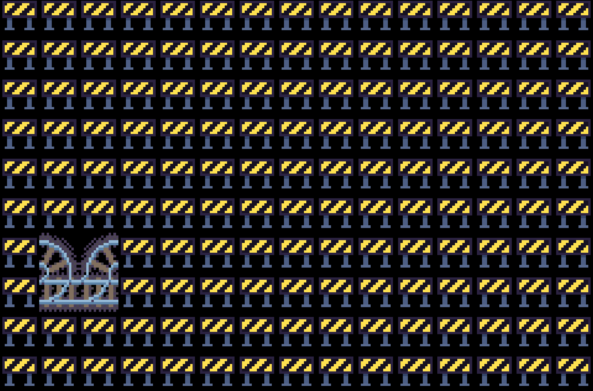

# WFC-Rails

This is a wave function collapse test made with [Rust](https://www.rust-lang.org/) using lightweight game library [Macroquad](https://macroquad.rs/).

**A:** Restart WFC  
**Mouse Wheel Up/Down:** Zoom in/out
**Left Click Hold and Move:** Move camera
**Space:** Reset camera position and zoom

